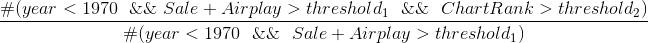

# Proposal

Hope we can finish this proposal by Friday 4:00 pm.

## We cooperate the proposal through overleaf.

## Below are some (maybe) useful links.

[Python api](https://github.com/guoguo12/billboard-charts): unofficial Python API for accessing music charts from Billboard

[50-years-of-pop-music](http://kaylinwalker.com/50-years-of-pop-music/): combined the lyrics from 50 years of Billboard Year-End Hot 100 (1965-2015) into one dataset for analysis

[Grammy award](https://en.wikipedia.org/wiki/List_of_Grammy_Award_categories#General_Field): songs awarded/nominated grammy awards are likely to last longer.

[Billboard greatest of all time](http://www.billboard.com/charts#id-chart-category-greatest-of-all-time): billboard data.

[Pop stars in 50 years](http://www.npr.org/sections/allsongs/2015/06/13/413922791/the-good-listener-will-we-remember-today-s-pop-stars-in-50-years): will people remember today's pop stars in 50 years?

[Billboard metrics](http://www.billboard.com/articles/business/8006673/billboard-charts-adjust-streaming-weighting-2018): Greater emphasis to be given to paid subscription streams with ad-supported activity remaining an important factor in the Billboard Hot 100, Billboard 200 and many other charts.

[Predicting a Song’s Path through the Billboard Hot 100](https://pdfs.semanticscholar.org/4b97/7c9a0cca735c10848043f99b01805812edb2.pdf) : research paper

[Diamond songs](http://www.billboard.com/articles/news/billboard-lists/7526410/diamond-certified-album-riaa-ranked): A list 90 diamond songs. A diamond song means 10,000,000 shipments.

[Mapping the Hometowns of America's Most Popular Musical Artists](http://thedataface.com/2015/10/culture/mapping-hometowns-billboard-artists)

[year end chart billboard hot 100](http://www.bobborst.com/popculture/top-100-songs-of-the-year/?year=1956)

## Potential data features
Add a feature whenever you come up in mind.

|Feature|
|:--|
|Name of Song|
|Artist(s)|
|Songwriter(s)|
|Company|
|Year|
|Genre|
|Billboard Ranks|
|Lyrics|
|Rhythm|
|Grammy|
|Albums|
|Social networks accounts|
|Rating|
|Technology|
|Geographic|

---

Fill the following table

Name of Song| Release Year | Sale(2017)| Airplay(2017) | Chart Rank (at Release Year)
:--         |:--           |:--        |:--            |:--                         
Hey Jude    |1968          |1000       | 1000          | 1

Surprising rate = 
